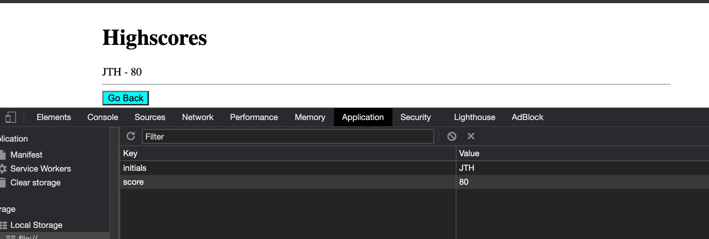
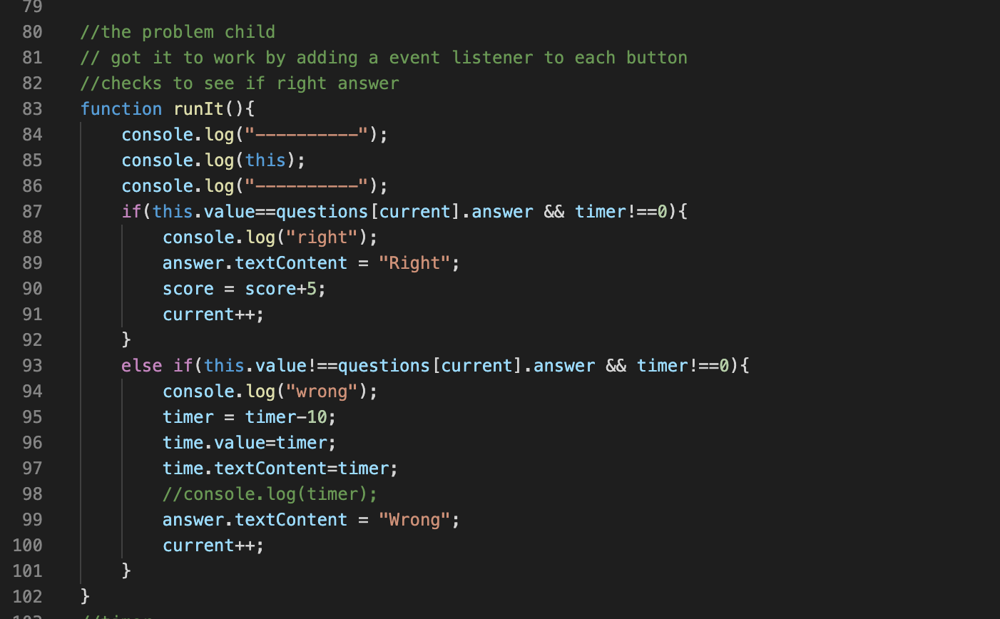

# code_quiz

## Description 

The criteria of this project were to create a coding quiz that presented questions and save the score in local storage and show it on another page. 

The project immensely helped me further sharpen my javascript skill and practice how to utilize storage and manipulate a timer.

The most significant hurdle that I had to overcome when completing this project was how to get the value and ID of the selected button. At first, I tried to use an on click function directly in the button in the HTML; however, this created problems such as double clicks and made it so rendering the questions were difficult. I solved this problem by using event listeners.

## Table of Contents 

* [Installation](#installation)
* [Usage](#usage)
* [Credits](#credits)
* [Badges](#badges)

## Installation

The installation for this project is to go my github repositories then navigate to Code_Refractor or click this link [Code Quiz](https://github.com/hondahelix/code_quiz) then click on the green code button in the top right. Then you can copy the code via ssh or by downloading a zip file.

## Usage 

This project's usage is to compete with other classmates to see if they could get a higher score on the quiz. As shown below is a glimpse of the project and the high score page, as well as a snippet of the code that caused me the most difficulties.

                        Highscore

                    Problem Child

## Credits
Third party assets and instruction was provided by the University of California, Berkeley Full Stack Coding Bootcamp program. As well as resources utilized Bootstrap.

[UCB Coding Bootcamp](https://bootcamp.berkeley.edu/coding/)

[Bootstrap](https://getbootstrap.com/)

---

## Badges

